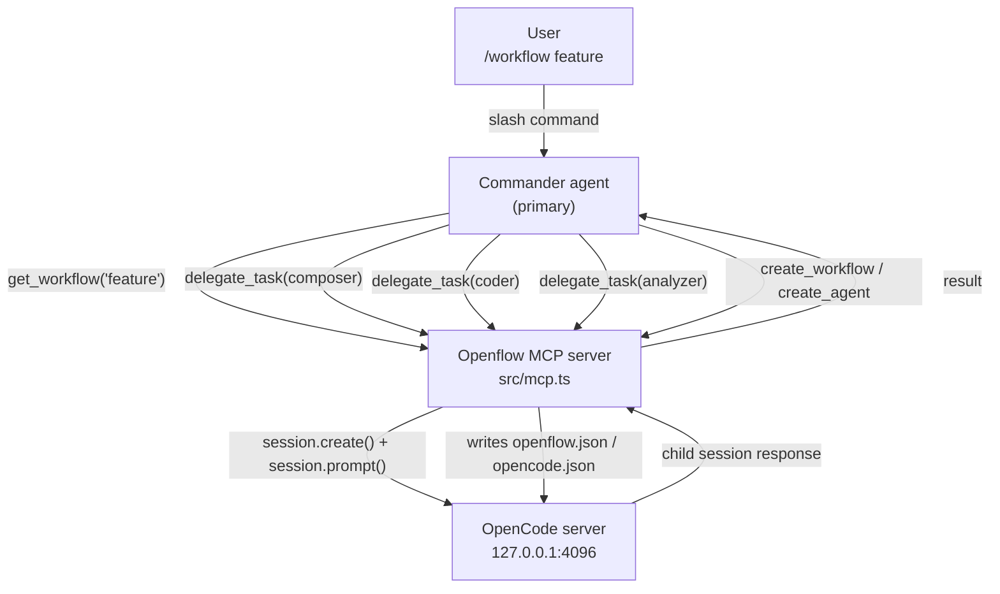
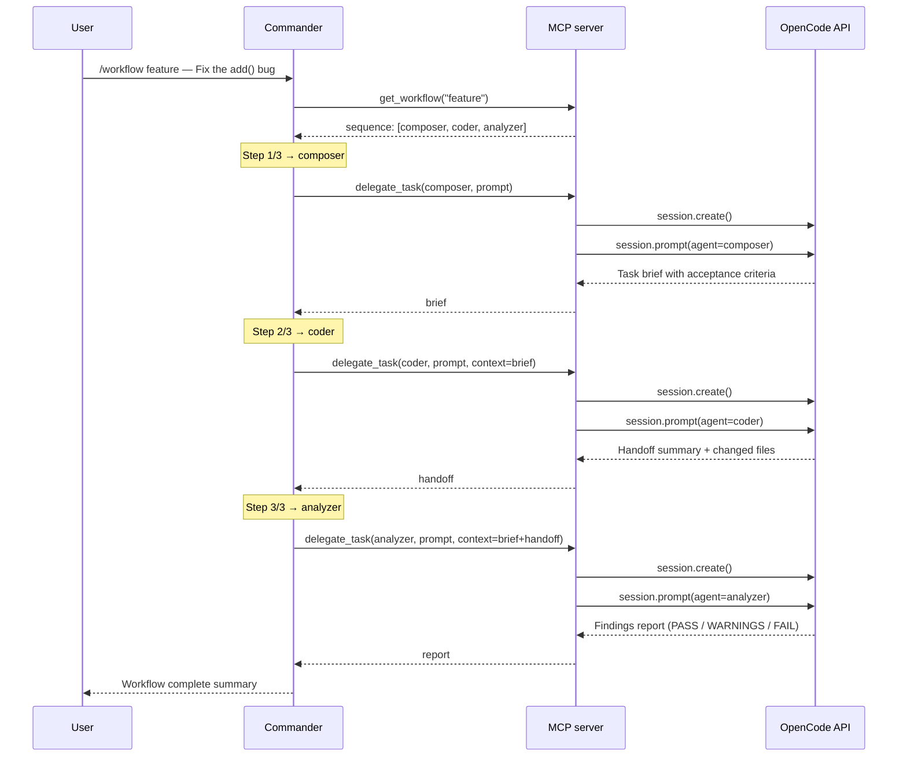
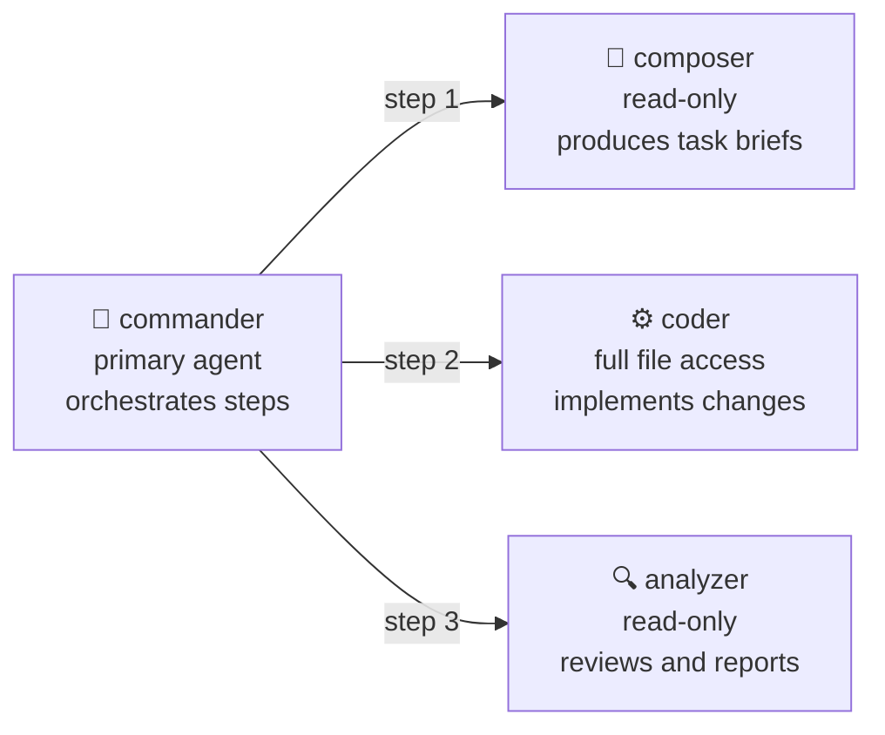
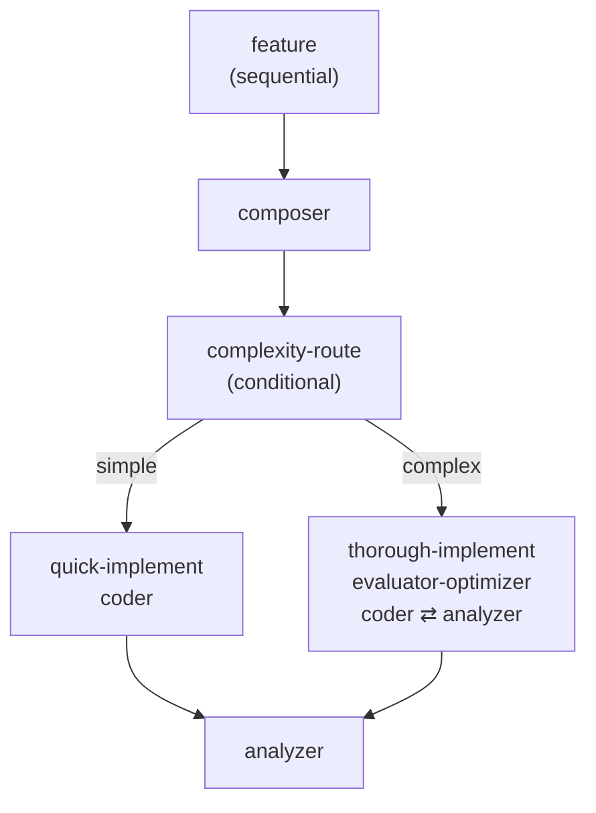

# openflow

> ⚠️ **BETA — IN ACTIVE DEVELOPMENT**
> This project is experimental. APIs, config formats, and agent behaviour will change between versions. Not recommended for production use. Feedback and issues welcome.

Multi-step workflow orchestration for [OpenCode](https://opencode.ai). Define named sequences of specialised agents — composer, coder, analyzer — and run them with a single slash command. Each agent hands off structured output to the next; nothing falls through the cracks.

```
/workflow feature

Running workflow feature: composer → coder → analyzer

Step 1/3 → composer   Produced task brief with acceptance criteria
Step 2/3 → coder      Fixed return a - b → return a + b, updated comment
Step 3/3 → analyzer   PASS — change is correct, minimal, no regressions

Workflow complete ✅
```

---

## How it works

Openflow is an [MCP](https://modelcontextprotocol.io) server that plugs into OpenCode. It exposes five tools (`delegate_task`, `get_workflow`, `list_workflows`, `create_workflow`, `create_agent`) and defines a **commander** agent that uses them to orchestrate workflows.



### Workflow execution

Each `delegate_task` call spawns a child session pinned to the named agent. The commander collects each result and passes it forward as structured context to the next step.



---

## Requirements

- [OpenCode CLI](https://opencode.ai) — `opencode` must be on your PATH
- Node.js 20+
- An LLM provider configured in OpenCode (Anthropic, OpenAI, etc.)

---

## Setup

### 1. Clone and install

```bash
git clone https://github.com/th-lange/openflow.git
cd openflow
npm install
```

### 2. Add to your project's `opencode.json`

Merge the following blocks into your project's `opencode.json` (or create one if you don't have it). Adjust the path to openflow to match where you cloned it.

```json
{
  "mcp": {
    "openflow": {
      "type": "local",
      "command": ["node", "--import", "tsx/esm", "/path/to/openflow/src/mcp.ts"]
    }
  },
  "command": {
    "workflow": {
      "description": "Execute a named workflow, e.g. /workflow feature",
      "agent": "commander",
      "template": "Run workflow: {{input}}"
    }
  },
  "agent": {
    "commander": { ... },
    "composer":  { ... },
    "coder":     { ... },
    "analyzer":  { ... }
  }
}
```

> The full agent definitions are in [`opencode.json`](./opencode.json) in this repo. Copy the `agent` block from there — the prompts are long and need to be included verbatim.

### 3. Create `openflow.json` in your project

Define which workflows you want and which agents they use:

```json
{
  "workflows": {
    "feature": {
      "description": "Full development cycle: compose brief → implement → review",
      "sequence": ["composer", "coder", "analyzer"],
      "commanderMayAlsoUse": ["composer", "coder", "analyzer"]
    },
    "review": {
      "description": "Code review only",
      "sequence": ["analyzer"],
      "commanderMayAlsoUse": ["analyzer"]
    }
  }
}
```

### 4. Start OpenCode in your project

```bash
opencode
```

OpenCode will automatically load the MCP server on startup. You should see all five tools (`delegate_task`, `get_workflow`, `list_workflows`, `create_workflow`, `create_agent`) become available.

---

## Usage

### Run a workflow

```
/workflow feature
```

Activates the commander, which looks up the `feature` workflow, announces the plan, and executes each step in sequence.

```
/workflow review
```

Runs just the analyzer on the current state of the codebase.

### List available workflows

```
/workflow
```

The commander calls `list_workflows` and shows what's defined in your `openflow.json`.

### Provide context

Just describe your task after the command — the commander passes it to each agent:

```
/workflow feature

The `parseDate()` function in src/utils/date.ts throws when given an
empty string. It should return null instead.
```

---

## Built-in workflows

| Workflow | Sequence | Use when |
|----------|----------|----------|
| `feature` | composer → coder → analyzer | You have a vague idea and want the full cycle |
| `implement` | coder → analyzer | You already have a spec or brief |
| `review` | analyzer | You want a code review without making changes |

---

## Built-in agents



### commander
Orchestrates the workflow. Calls `get_workflow` to look up the sequence, then `delegate_task` for each step in order. Passes each step's output as structured context to the next. Does not write code or edit files directly.

### composer
Turns a vague request into a structured **task brief** with a problem statement, acceptance criteria, constraints, and assumptions. Has no file access — purely a planning agent.

Output format:
```
## Task brief
**Problem:** ...
**Acceptance criteria:** ...
**Constraints:** ...
**Assumptions:** ...
```

### coder
Implements the brief. Reads existing code first, makes the smallest change that satisfies every acceptance criterion, and ends with a **handoff summary** naming which files changed and what risks the analyzer should check.

### analyzer
Reviews the coder's changes against the original acceptance criteria. Produces a **findings report** with a verdict (PASS / PASS WITH WARNINGS / FAIL) and a table of specific findings by severity (blocker / warning / suggestion). Does not modify files.

---

## Defining custom workflows

### Via the tool (recommended)

Ask the commander to create one for you:

```
Create a workflow called "hotfix" that runs coder then analyzer,
with a description "Fast path for urgent fixes".
```

The commander calls `create_workflow`, which validates agent names and writes to `openflow.json`. The workflow is available immediately — no restart needed.

### Manually

Edit `openflow.json` in your project root:

```json
{
  "workflows": {
    "my-workflow": {
      "description": "What this workflow does",
      "sequence": ["composer", "coder", "analyzer"],
      "commanderMayAlsoUse": ["composer", "coder", "analyzer"]
    }
  }
}
```

| Field | Required | Description |
|-------|----------|-------------|
| `sequence` | yes | Ordered list of agent names to run. Each must be defined in `opencode.json`. |
| `commanderMayAlsoUse` | no | Agents the commander may deviate to when a step fails. Defaults to `[]`. |
| `description` | no | Shown by `list_workflows`. |

---

## Defining custom agents

### Via the tool (recommended)

Ask the commander to create one for you:

```
Create a new agent called "documenter" that writes JSDoc comments for
TypeScript functions. It should be read-only with no bash access.
```

The commander calls `create_agent`, which writes to `opencode.json`. You then need to **restart OpenCode** (or re-open the project) for the new agent to become available.

```
Create a workflow called "document" that just runs the documenter agent.
```

After reloading, `/workflow document` runs the new agent.

### Manually

Add an entry to the `agent` block in `opencode.json`:

```json
{
  "agent": {
    "documenter": {
      "description": "Writes JSDoc comments for TypeScript functions.",
      "mode": "subagent",
      "prompt": "You are a documentation agent. Your only job is to add JSDoc comments to TypeScript functions...",
      "permission": {
        "edit": "allow",
        "bash": "deny"
      },
      "tools": {}
    }
  }
}
```

| Field | Default | Description |
|-------|---------|-------------|
| `mode` | `subagent` | `subagent` (called by commander) or `primary` (user-facing) |
| `prompt` | — | System prompt. Be specific about what the agent must and must not do. |
| `permission.edit` | `deny` | `allow` or `deny` file edits |
| `permission.bash` | `deny` | `allow` or `deny` shell commands |
| `model` | system default | Override with e.g. `anthropic/claude-haiku-4-5` for cheaper/faster agents |

> **Note:** changes to `opencode.json` require an OpenCode restart before new agents are usable via `delegate_task`.

---

## Development

```bash
# Validate session.prompt() spawning works in your environment
npm run proto

# Unit tests (config loaders, no LLM needed, ~250ms)
npm test

# Full E2E suite (starts its own OpenCode server, makes real LLM calls, ~5 min)
npm run e2e
```

### Project structure

```
openflow/
├── src/
│   ├── mcp.ts                  # MCP server entry point
│   ├── tools/
│   │   ├── delegate-task.ts    # Core delegation tool
│   │   ├── workflow-tools.ts   # get_workflow, list_workflows
│   │   └── management-tools.ts # create_workflow, create_agent
│   ├── config/
│   │   ├── agent-registry.ts   # Fetches agents from OpenCode API
│   │   └── workflow-loader.ts  # Reads + validates openflow.json
│   ├── state/
│   │   └── step-store.ts       # Session-keyed workflow progress
│   ├── agents/
│   │   ├── commander.md        # Commander system prompt (source of truth)
│   │   ├── composer.md
│   │   ├── coder.md
│   │   └── analyzer.md
│   └── test/
│       ├── agent-registry.test.ts
│       ├── workflow-loader.test.ts
│       └── management-tools.test.ts
├── opencode.json               # Agent definitions + MCP + command config
└── openflow.json               # Sample workflow definitions
```

---

## How context propagation works

After each step the commander builds a context block and passes it into the next `delegate_task` call:

```
## Prior step results

### Step 1 — composer
The add() function in calculator.ts subtracts instead of adds.
Acceptance criteria: return value equals a + b for all inputs.
Constraints: do not change the function signature.

### Step 2 — coder
Changed return a - b to return a + b on line 3.
Removed stale inline comment.
```

This means the analyzer sees both the original brief and exactly what the coder did — without the commander having to summarise or transform anything manually.

---

## Roadmap — agentic patterns

> The following patterns are **in development**. The current release only supports the sequential pipeline. These will each add a `pattern` field to workflow definitions.

The core insight: a workflow's `sequence` field today implies a fixed linear pipeline. Adding `pattern` unlocks fundamentally different coordination strategies between agents.

---

### Sequential pipeline *(current)*

```json
{ "pattern": "sequential", "sequence": ["composer", "coder", "analyzer"] }
```

Fixed order. Each step receives the prior step's output as context. This is the only pattern available today.

---

### Orchestrator

```json
{
  "pattern": "orchestrator",
  "agents": ["composer", "coder", "analyzer", "debugger"],
  "maxIterations": 6,
  "satisfactionCriteria": "The task is complete and all acceptance criteria are met."
}
```

A dedicated orchestrator agent receives the task and dynamically decides which agent to call next based on the current state. It keeps delegating until its own satisfaction check passes or `maxIterations` is reached. Unlike sequential, the order is not fixed — the orchestrator decides at runtime.

**Good for:** tasks where the right sequence can't be known upfront; research-then-implement workflows; agents that may need to be called more than once.

**Implementation:** The orchestrator is itself an agent with `delegate_task` access. The MCP server adds a loop guard (`maxIterations`) and injects the satisfaction check as a required final step before the orchestrator can return.

---

### Fan-out / Best-of-N

```json
{
  "pattern": "fanout",
  "agents": ["coder", "coder", "coder"],
  "picker": "analyzer",
  "pickerPrompt": "Select the implementation with the best code quality, clarity, and minimal surface area."
}
```

The same task is dispatched to N agents (potentially the same agent type run N times, or N different specialists). A picker agent receives all results and selects the best one. The winning result is returned as the workflow output.

**Good for:** code generation where quality matters (get 3 implementations, keep the cleanest); architecture proposals; any task where you want diversity of output before committing.

**Implementation:** `delegate_task` is called N times (in parallel via `Promise.all`). All results are bundled and sent to the picker agent. The picker's selection is the final output.

---

### Evaluator-Optimizer loop

```json
{
  "pattern": "evaluator-optimizer",
  "producer": "coder",
  "evaluator": "analyzer",
  "maxIterations": 4,
  "passCriteria": "PASS"
}
```

The producer generates output; the evaluator scores it. If the evaluator's verdict doesn't match `passCriteria`, the producer is called again with the evaluator's feedback as context. Loops until the criteria is met or `maxIterations` is exhausted.

**Good for:** code quality enforcement; test coverage; any task with a clear binary pass/fail criterion that an agent can evaluate.

**Implementation:** New `evaluatorOptimizerLoop` in the MCP server. Each iteration passes the previous evaluator feedback to the producer via the `context` field. On FAIL the loop continues; on PASS or max iterations it exits and returns the last producer output.

---

### Parallel / Map-Reduce

```json
{
  "pattern": "parallel",
  "subtasks": [
    { "agent": "frontend-coder", "prompt": "Implement the UI component" },
    { "agent": "backend-coder",  "prompt": "Implement the API endpoint" },
    { "agent": "db-coder",       "prompt": "Write the migration" }
  ],
  "merger": "composer"
}
```

The task is split into N independent subtasks, each dispatched to a specialist agent simultaneously. A merger agent consolidates the results into a coherent whole.

**Good for:** large features spanning multiple layers (frontend + backend + DB); reviewing multiple files independently; parallelising any set of work that has no inter-dependency.

**Implementation:** Subtask `delegate_task` calls run concurrently via `Promise.all`. The merger receives all outputs as structured context. The split can be defined statically in config or dynamically by a splitter agent.

---

### Conditional branching

```json
{
  "pattern": "conditional",
  "router": "classifier",
  "routes": [
    { "condition": "bug",          "workflow": "debug" },
    { "condition": "feature",      "workflow": "feature" },
    { "condition": "refactor",     "workflow": "implement" }
  ],
  "default": "feature"
}
```

A router agent classifies the incoming request and dispatches to the matching workflow. Routes map condition labels to existing workflow names.

**Good for:** heterogeneous task queues where you don't want to pre-specify the workflow; teams that want a single entry point that self-routes; catch-all "do the right thing" commands.

**Implementation:** The router agent is called first, asked to return one of the condition labels as structured output. The MCP server reads the label, looks up the target workflow, and executes it. Falls back to `default` if no route matches.

---

### Human checkpoint

```json
{
  "pattern": "sequential",
  "sequence": [
    "composer",
    { "checkpoint": "Review the brief above and confirm before implementation begins." },
    "coder",
    { "checkpoint": "Review the diff above before the analyzer runs." },
    "analyzer"
  ]
}
```

Designated steps in the sequence pause and surface a message to the user. Execution resumes only after the user explicitly continues (or can be cancelled).

**Good for:** sensitive operations (schema migrations, deploys, destructive changes); any workflow where human sign-off before a point of no return is required; keeping a human in the loop without abandoning automation.

**Implementation:** Checkpoint steps are not agent calls — they emit a structured pause event to the OpenCode session, which surfaces to the user as an interactive prompt. The MCP server holds the workflow state until the user responds.

---

### Debate / Adversarial

```json
{
  "pattern": "debate",
  "proposer": "architect",
  "critic": "security-reviewer",
  "rounds": 2,
  "judge": "analyzer"
}
```

A proposer agent makes a case; a critic agent argues against it. They alternate for `rounds` turns, each seeing the other's arguments. A judge agent reviews the full transcript and delivers a verdict.

**Good for:** architecture decisions with real tradeoffs; security review of a proposed design; any decision where you want a structured devil's advocate before committing.

**Implementation:** Proposer and critic take turns via `delegate_task`, each receiving the full prior debate as context. After `rounds` exchanges the judge receives the entire transcript and returns a decision with reasoning.

---

### Pattern composition *(planned)*

Any workflow can be used as a step inside another workflow. Rather than agent names only, a step in a sequence can be a workflow reference:

```json
{
  "workflows": {
    "feature": {
      "pattern": "sequential",
      "sequence": [
        "composer",
        { "workflow": "complexity-route" },
        "analyzer"
      ]
    },

    "complexity-route": {
      "pattern": "conditional",
      "router": "classifier",
      "routes": [
        { "condition": "simple",  "workflow": "quick-implement" },
        { "condition": "complex", "workflow": "thorough-implement" }
      ],
      "default": "quick-implement"
    },

    "quick-implement": {
      "pattern": "sequential",
      "sequence": ["coder"]
    },

    "thorough-implement": {
      "pattern": "evaluator-optimizer",
      "producer": "coder",
      "evaluator": "analyzer",
      "maxIterations": 4,
      "passCriteria": "PASS"
    }
  }
}
```

`/workflow feature` resolves the composition at runtime:



**Design rules:**

- `openflow.json` stays **flat** — all workflows defined at the top level, never nested in JSON
- A step is one of: agent name (string) · workflow reference `{ "workflow": "name" }` · checkpoint `{ "checkpoint": "..." }`
- Cycles are rejected at load time (`feature → complexity-route → feature` throws on startup, not at runtime)
- Nested workflows govern their own deviations — `commanderMayAlsoUse` at the outer level applies only to that level's own direct steps

**Good for:** sequential commander that picks a sub-pattern based on request complexity; reusing a shared review step across multiple larger workflows; quality gates that only apply to certain branches.

---

## License

MIT
